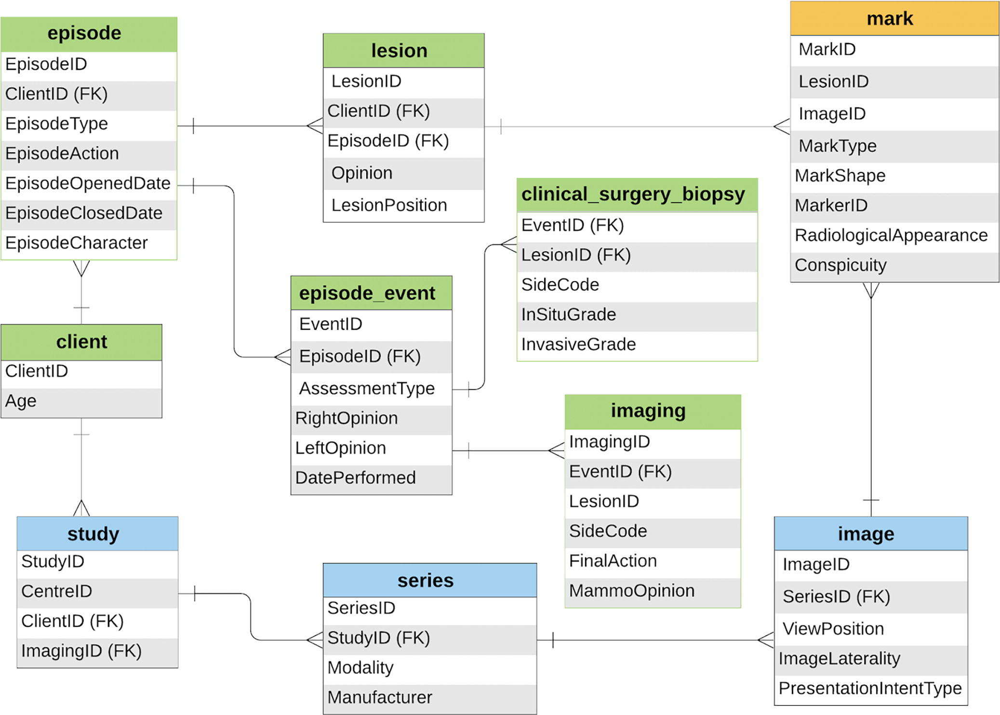

# Understanding the OPTIMAM Dataset Structure

This document explains the hierarchical structure of the OPTIMAM mammography dataset and how it relates to the real-world clinical workflow of breast cancer screening.

## Key Terms

### Study

An imaging examination comprising a number of series. Each study represents a complete examination session and has:

- A unique Study Instance UID
- A collection of series from that examination
- A date when the examination was performed
- Associated event types (medical procedures)

### Series

A collection of images taken during one examination by one modality, for a given position of the patient on the acquisition device. In Full-Field Digital Mammography:

- Each image is typically associated with one unique series
- All images in a series share the same:
  - Patient position
  - Technical parameters
  - Acquisition modality
  - Processing intent

### Episode

An episode contains a set of medical procedures or events associated with the treatment or diagnosis of a clinical condition. Medical imaging studies are included with each episode, and are typically (but not always) linked to one or more events.

1. **Clinical Information**:

   - Screening opinions
   - Assessment findings (if recalled)
   - Biopsy results (if performed)
   - Surgery details (if applicable)

2. **Image Studies**:
   - One or more imaging examinations
   - Each examination (study) contains multiple series
   - Each series typically contains one image

Example of Data Organization:

```
Episode (Clinical Event)
├── Clinical Information
│   ├── Initial Screening Opinion
│   ├── Assessment Findings (if recalled)
│   ├── Biopsy Results (if performed)
│   └── Surgery Details (if applicable)
└── Studies (Imaging Examinations)
    └── Study (One Complete Examination)
        ├── Series 1 (One Position/View)
        │   └── Image (e.g., R-CC FOR PROCESSING)
        ├── Series 2 (Another Position/View)
        │   └── Image (e.g., R-CC FOR PRESENTATION)
        ├── Series 3 (Another Position/View)
        │   └── Image (e.g., R-MLO FOR PROCESSING)
        └── Series 4 (Another Position/View)
            └── Image (e.g., R-MLO FOR PRESENTATION)
```

## Data Hierarchy

```
Client (Woman)
├── Overall Classification (B = Benign, M = Malignant)
└── Episodes (Complete Screening/Diagnostic Events)
    ├── Clinical Information
    │   ├── Screening Opinions (L/R breasts)
    │   ├── Assessment Results
    │   ├── Biopsy Results
    │   └── Surgery Results
    └── Studies (Different types of image acquisitions)
        ├── Screening Study (Standard 4 views)
        ├── Assessment Study (Additional views)
        ├── Biopsy Study (Procedure-related)
        └── Surgery Study (Pre/post operation)
            └── Series (Sets of Related Images)
                └── Images (Individual Mammograms)
```

## File Structure

```
OMI-DB/
├── DATA/
│   └── demd<ID>/                # Client directory
│       ├── NBSS_demd<ID>.json   # Clinical data
│       ├── IMAGEDB_demd<ID>.json # Image metadata
│       └── <study_uid>/         # Study directories
│           └── <series_uid>.json # Series metadata
└── IMAGES/                      # Actual DICOM images
```

## Clinical Workflow Example

Here's how the dataset structure maps to a woman's journey through breast cancer screening:

### 1. Routine Screening Episode

- **Standard Views (First Study)**:
  - Right CC (Cranio-Caudal)
  - Right MLO (Medio-Lateral Oblique)
  - Left CC
  - Left MLO
- **Initial Reading**:
  - Multiple radiologists review
  - Opinions recorded per breast
  - Decision: Normal or Recall

### 2. Assessment Episode (If Recalled)

- **Additional Studies May Include**:
  - Magnification views
  - Spot compression views
  - Additional angles
  - Ultrasound images
- **Assessment Results**:
  - Mammographic opinion (R1-R5)
  - Ultrasound findings (U1-U5)
  - Clinical examination

### 3. Biopsy (If Suspicious)

- **New Images**:
  - Specimen radiographs
  - Post-biopsy mammograms
- **Results**:
  - Biopsy findings (B1-B5)
  - Histological grade
  - Hormone receptor status

### 4. Surgery (If Malignant)

- **Final Diagnosis**:
  - Surgical pathology
  - Cancer type and stage
  - Treatment plan

## Data Example

```json
{
  "ClientID": "demd1457",
  "Classification": "M",
  "9994": {
    // Episode ID
    "StudyList": [
      "1.2.826.0.1.3680043.9.3218.1.1.3850610.1631.1511384163736.2734.0"
    ],
    "SCREENING": {
      "left_opinion": "Normal",
      "right_opinion": "Malignant"
    },
    "ASSESSMENT": {
      "R": {
        "MammoOpinion": "R5",
        "UssOpinion": "U5",
        "MammoSizeMm": "20"
      }
    },
    "BIOPSYWIDE": {
      "diagnosticsetoutcome": "W+",
      "right_opinion": "Malignant"
    }
  }
}
```

## Key Points

1. **Episodes**:

   - Represent complete screening/diagnostic events
   - Contain all clinical decisions and images
   - Have separate opinions for left and right breasts
   - Can evolve from screening to diagnosis

2. **Studies**:

   - Represent sets of images taken together
   - Multiple studies possible in one episode
   - Linked to clinical findings via StudyList

3. **Series**:

   - Groups of related images
   - Same view/processing
   - Technical parameters consistent
   - Multiple images possible per series

4. **Labels**:
   - Exist at episode level
   - Separate for each breast
   - Can change through episode
   - Final classification at client level

## Practical Implications

1. **For Machine Learning**:

   - Labels are per breast, per episode
   - Multiple images may share same label
   - Temporal progression available
   - Rich clinical context

2. **For Validation**:

   - Multiple reader opinions available
   - Follow-up outcomes known
   - Complete diagnostic pathway
   - Clinical decision points recorded

## Database structure


_Schema shows simplified data model for radiologic (blue), clinical and pathologic (green), and ground truth (orange) information stored in the OPTIMAM Mammography Image Database. FK = foreign key._

image.png

```

```
